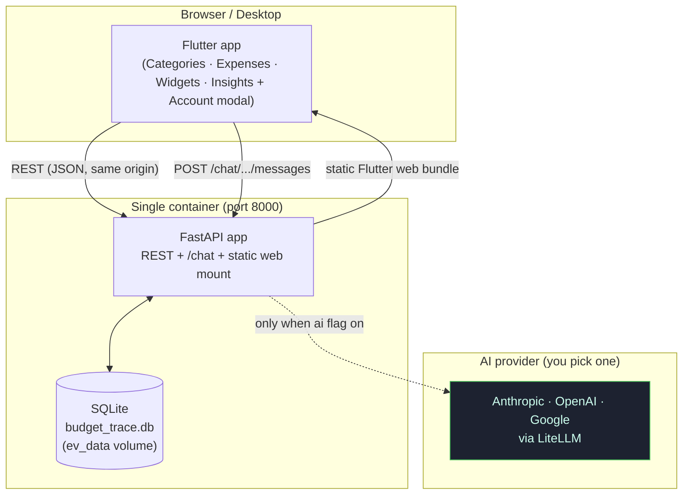
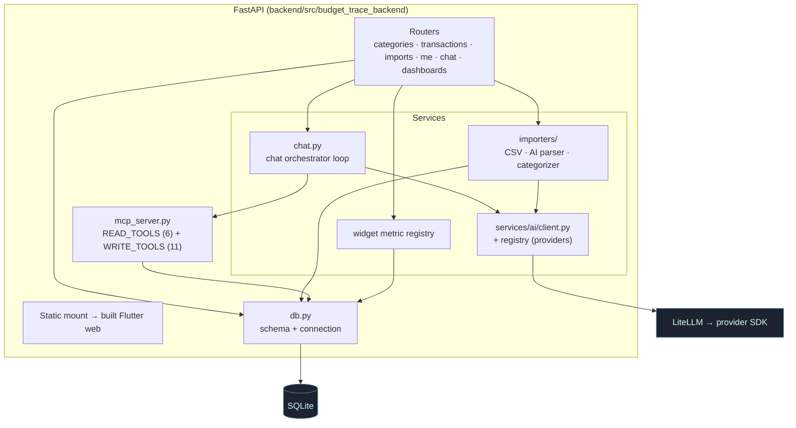
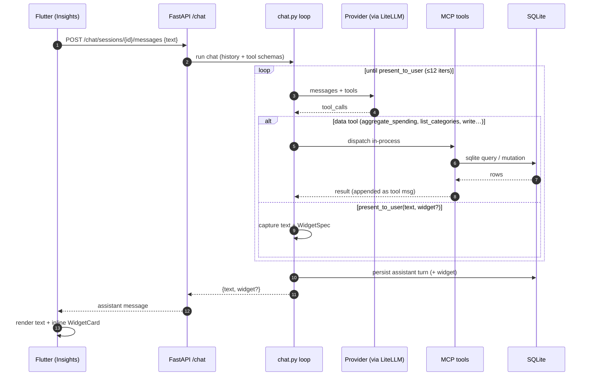
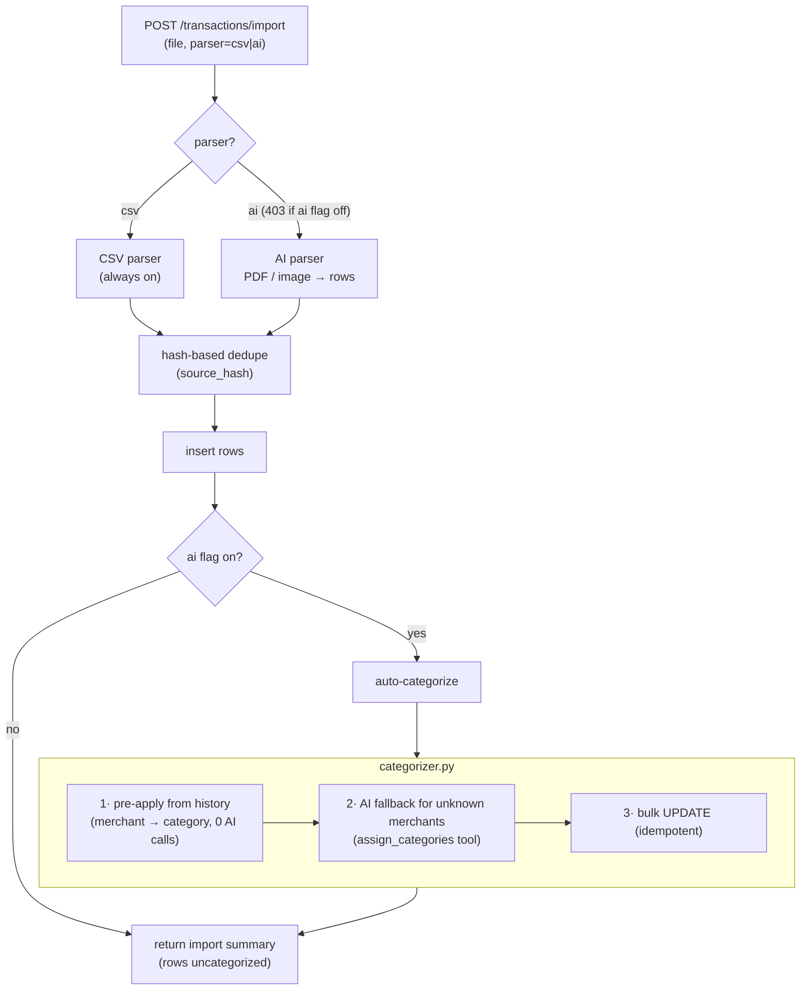
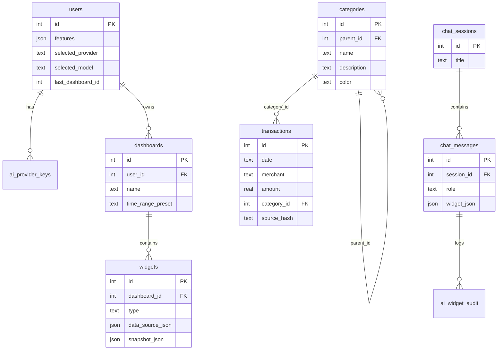

# Architecture

A high-level tour of how Expense Visualizer fits together. For the deep dives,
follow the links into the per-topic docs. Diagrams below are
[Mermaid](https://mermaid.js.org/) — GitHub renders them inline.

> Naming: the user-facing brand is **Expense Visualizer**; internal package
> names keep the legacy `budget_trace` identifier. See [conventions.md](conventions.md).

## 1. The big picture

One Flutter app, one Python backend, one SQLite file, and a pluggable AI
provider reached over the network. In production it all ships as a **single
container**: the backend serves the pre-built Flutter web bundle as static files
and answers the API from the same origin, so there's no CORS and no separate web
host.

- **Frontend** — Flutter, four tabs plus an Account modal. All data comes from
  the backend; there is no in-memory mock divergence. See [frontend.md](frontend.md).
- **Backend** — FastAPI. Owns the SQLite store, the REST surface, the chat
  orchestrator, and the MCP server. See [backend.md](backend.md).
- **AI provider** — optional. Everything except the AI surfaces (chat, PDF/image
  parsing, auto-categorize) works with **no key**. Provider calls are normalised
  through LiteLLM so the backend is provider-agnostic. See [insights-ai.md](insights-ai.md).

Deployment shapes (same code, different wiring) live in the
[README](../README.md): single prod container, a live-reload dev compose, a
no-Docker host-process setup, and a browser-only [demo](#7-the-demo-build) on
GitHub Pages.

## 2. Inside the backend

The FastAPI app is a thin router layer over a set of services and a single
SQLite connection. The same data-access functions that back the REST routes are
also exposed as **MCP tools** the chat AI calls — one source of truth, two
front doors.

Key idea — **two tool surfaces, deliberately separate**:

- **MCP data tools** are *portable read + write access*. Their schema *is* the
  data API; they work the same whether driven by the in-process chat loop or by
  an external MCP client (Claude Desktop, scripts). `mcp_server.py` is both a
  standalone stdio server **and** an in-process function dictionary the
  orchestrator dispatches against — the same Python functions back both paths.
- **`present_to_user`** is *output formatting* for this app's chat UI (text +
  an optional widget). It is intentionally **not** an MCP tool — rendering into
  this specific chat surface isn't portable, so it lives only in the
  orchestrator. See [insights-ai.md](insights-ai.md).

## 3. One chat round-trip

What happens when the user asks the Insights tab a question. The conversation is
**stateless on the backend** in the sense that each turn replays the stored
session history; sessions/messages themselves are persisted in SQLite.

- Tool schemas are built from the Python signatures of the MCP tools plus the
  inline `present_to_user` schema, in OpenAI/LiteLLM function-tool shape.
- The model **must** call `present_to_user` exactly once to end the turn; its
  args become the HTTP response body. The optional `widget` is parsed into a
  `WidgetSpec` of one of six types (`timeseries`, `bar`, `pie`, `query_value`,
  `table`, `treemap`) and rendered by the same `WidgetCard` used on dashboards.
- The AI can **mutate** data too (rename/move categories, recategorize
  transactions) via the write tools — not just read it.
- **Streaming is not implemented** — the backend waits for the full response.

## 4. Upload & auto-categorize

CSV import is **always available, no key**. PDF/image parsing and
auto-categorization run only when the `ai` flag is on. Auto-categorization *is*
shipped (an older revision of this doc called it out-of-scope — that's stale).

Best-effort by design: categorization failures are swallowed into the response
so an import never breaks. Full contract in [upload.md](upload.md).

## 5. Data model

Single-user (hardcoded `id=1`), one SQLite file. The schema is created on first
boot by the FastAPI startup lifespan (`bootstrap_db()`), which also ensures the
symbolic **"Budget"** root category and the default user row — **no separate
seed step, and a fresh DB starts empty**. Categories are a self-referential tree;
transactions are flat and time-indexed.

Other tables not shown: `discovered_models` (live-fetched provider catalogs +
pricing), `ai_usage` (per-call token/cost tracking across chat, AI parser, and
auto-categorize). Full schema, conventions, and the test-only seed in
[data-model.md](data-model.md).

## 6. Feature flags

Two flags, resolved per request and exposed via `GET /me`:

| Flag | Default | Gates |
|------|---------|-------|
| `ai` | **off** | Insights chat, PDF/image parsing, auto-categorize |
| `widgets` | **on** | Widgets tab + dashboards CRUD |

Toggled through `PATCH /me`, or overridden for dev/tests with the
`BUDGET_TRACE_FEATURES` env var (comma-separated). See [account.md](account.md).

## 7. The demo build

The same Flutter code compiles to a browser-only **demo** via
`--dart-define=DEMO_MODE=true`, published to GitHub Pages. In demo mode an
in-memory mock backend replaces every HTTP call: sample data, canned AI replies,
and faked upload results, all reset on reload. `main` carries only the *inert
seam* (the `DEMO_MODE`-gated hooks); the `demo` branch adds the mock backend and
is kept in sync by `.github/workflows/sync-demo.yml`, then deployed by
`deploy-demo.yml`. Live at
[alexdalgleishmorel.github.io/budget-trace](https://alexdalgleishmorel.github.io/budget-trace/).

## 8. Deliberately out of scope

- **Auth & multi-user.** Single hardcoded user (`id=1`); no login. See the
  auth-TODO in [account.md](account.md).
- **Streaming chat.** The orchestrator returns the full response in one shot.
- **Async import jobs.** CSV and AI parsing both finish inside the POST; the
  `job_id` field is informational. A polling endpoint slots in if needed.
